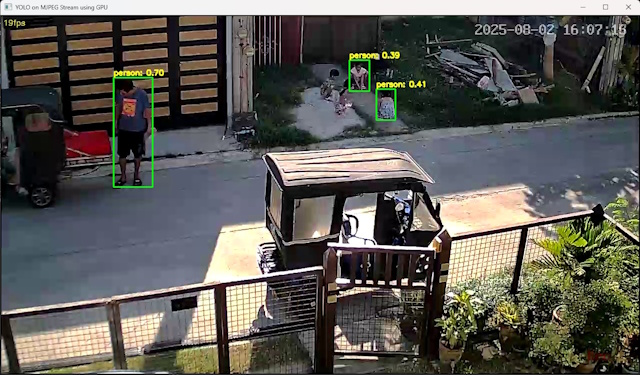
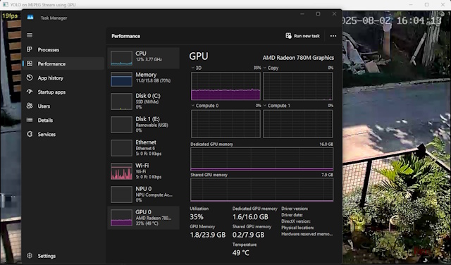

# CCTV Monitor with YOLO and ONNX Runtime

This project provides a Python script to monitor a CCTV RTSP stream using a YOLO object detection model accelerated with ONNX Runtime. It supports GPU acceleration on NVIDIA, Intel, and AMD hardware.<br><br>
The CCTV stream is from V380 Pro IP camera, like this: 
<br><br>

<br><br> Sample detection: <br><br>

<br><br> CPU and GPU Load: <br><br>


## Features

- Real-time object detection on RTSP or webcam streams
- Uses Ultralytics YOLO models (`.pt`), automatically exports to ONNX (`.onnx`)
- Hardware acceleration via DirectML on Windows OS. Fallback to CPU.
- Displays detected objects with class names and confidence
- Shows real-time FPS and can skip frames to maintain target frame rate

## Requirements

- Python 3.8+
- Windows (DirectML/AMD GPU support), Linux (CUDA/NVIDIA GPU support), or Intel OpenVINO
- RTSP-compatible CCTV camera or webcam

### Python Packages

Install dependencies with:

```
pip install -r requirements.txt
```

Contents of `requirements.txt`:
```
onnxruntime-directml
opencv-python
ultralytics
```

> For NVIDIA GPU support, install `onnxruntime-gpu` instead of `onnxruntime-directml`.
> For Intel GPU/CPU support, install `onnxruntime-openvino`.

## Usage

1. **Clone the repository:**
   ```
   git clone https://github.com/afdp777/cctv_monitor.git
   cd cctv_monitor
   ```

2. **Create and activate a virtual environment:**
   ```
   python -m venv venv
   venv\Scripts\activate   # On Windows
   # or
   source venv/bin/activate  # On Linux/macOS
   ```

3. **Install dependencies:**
   ```
   pip install -r requirements.txt
   ```

4. **Configure the stream URL:**
   - Edit `watch_cctv_gpu.py` and set `stream_url` to your RTSP stream.

5. **Run the script:**
   ```
   python watch_cctv_gpu.py
   ```

## Hardware Acceleration

The script tries to use the best available provider in this order:
1. `CUDAExecutionProvider` (NVIDIA GPU)
2. `OpenVINOExecutionProvider` (Intel GPU/CPU)
3. `DmlExecutionProvider` (AMD GPU via DirectML)
4. Falls back to CPU if no GPU provider is available

You can check which provider is active in the console output.

## Notes

- The script will download and export the YOLO `.pt` model to ONNX format on first run.
- Class names are extracted from the Ultralytics model before export.
- For best performance, ensure your GPU drivers are up to date.

## License

MIT License

---
